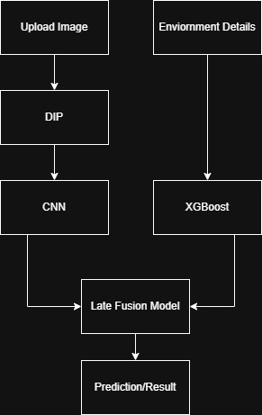

# DeepReef — Coral Bleaching Detection System

> Multimodal deep learning system for coral bleaching detection combining underwater digital image processing, a fine-tuned NOAA marine science classifier, XGBoost environmental modeling, and Groq LLM explanations.

# Demo Video

[Click Here](https://www.loom.com/share/a26b1ef8fb954787a4dadb9dc3e67b7d)

---

## Architecture



---

## What It Does

DeepReef takes an underwater coral photograph alongside optional environmental parameters and returns:

- **Prediction** — bleached or healthy
- **Risk level** — Low / Moderate / High
- **Image signal** — CNN bleaching probability from visual analysis
- **Environmental stress score** — XGBoost model output
- **Natural language explanation** — generated by Groq LLM (llama-3.1-8b)

---

## Environmental Parameters Guide

When submitting environmental data, use these reference ranges:

| Parameter | Unit | Typical Healthy Reef | Bleaching Risk Threshold | Description |
|---|---|---|---|---|
| **Temperature** | °C | 24–28 | > 28°C | Sea surface temperature. Coral thermal stress begins above 28°C. |
| **DHW** | degree heating weeks | 0–4 | > 8 DHW | NOAA metric — cumulative heat stress over 12 weeks. Above 8 = bleaching likely. Above 16 = mortality risk. Obtain from [NOAA CoralWatch](https://coralreefwatch.noaa.gov). |
| **SSTA** | °C | -0.5 to +0.5 | > +1.0°C | Sea surface temperature anomaly — how much warmer/cooler than the long-term average. Negative = cooler than normal (protective). |
| **Turbidity** | 0–1 scale | 0.02–0.10 | > 0.15 | Water clarity. Clear water = low turbidity. High turbidity reduces light penetration and stresses coral. |
| **Windspeed** | knots | 4–10 | < 3 (calm) | Higher wind increases water mixing, reducing thermal stratification and bleaching risk. |
| **Sheltered** | Yes / No | — | No (exposed) | Whether the site is sheltered from open ocean waves. Exposed sites experience more stress under warm conditions. |

### How Bleached vs Healthy Coral Looks

| | Healthy Coral | Bleached Coral |
|---|---|---|
| **Colour** | Warm browns, yellows, oranges, greens — pigment from symbiotic algae (zooxanthellae) | White, pale, or translucent — pigment loss as algae are expelled |
| **Texture** | Regular ridge/polyp patterns visible, high structural complexity | Flattened, homogeneous texture — loss of surface detail |
| **Image signal** | Low rCBI (red-blue ratio), high GLCM energy | High rCBI, low GLCM energy, low homogeneity |
| **What causes it** | Stable temperature and water chemistry | Prolonged thermal stress (> 1°C above summer max) |
| **Reversibility** | — | Partial: coral can recover if stress is removed within weeks |

---

## Project Structure

```
CoralReef/
├── app.py                      # FastAPI backend — main inference pipeline
├── preprocessor.py             # DIP preprocessing module
├── xgboost_coral.py            # XGBoost training script + inference wrapper
├── xgboost_v2.pkl              # Trained XGBoost model bundle
├── .env                        # API keys (not committed)
├── requirements.txt
├── models/
│   └── best.pt                 # Fine-tuned NOAA YOLO11n-cls weights
├── data/
│   ├── raw/                    # Original dataset
│   ├── clean_flat/             # DIP-preprocessed flat images
│   └── clean/                  # Train/val split of preprocessed images
│       ├── train/
│       │   ├── healthy/
│       │   └── bleached/
│       └── val/
│           ├── healthy/
│           └── bleached/
├── runs/                       # YOLO training runs and weights
│   ├── noaa_finetuned/
│   └── noaa_finetuned_v4/
├── frontend/
│   └── src/
│       └── App.tsx             # React frontend
└── docs/
    └── architecture.png
```

---

## Setup

### 1. Clone the repo

```bash
git clone https://github.com/yourusername/deepreef.git
cd deepreef
```

### 2. Install dependencies

```bash
pip install -r requirements.txt
```

### 3. Set up environment variables

Create a `.env` file in the project root:

```
GROQ_API_KEY=your_groq_api_key_here
```

Get a free Groq API key at [console.groq.com](https://console.groq.com).

### 4. Download model weights

The fine-tuned NOAA classifier weights (`best.pt`) are not committed to the repo due to file size. 

- Train your own using `runs/noaa_finetuned_v4/weights/best.pt` after running the training script

Place the file at `models/best.pt`.

### 5. Run the backend

```bash
uvicorn app:app --reload --port 8000
```

### 6. Run the frontend

```bash
cd frontend
npm install
npm run dev
```

---

## Training Your Own Models

### DIP preprocessing — process the full dataset

```bash
python preprocessor.py --input data/raw --output data/clean
```

### Fine-tune the NOAA classifier

```python
from ultralytics import YOLO

model = YOLO("path/to/noaa_pretrained.pt")
model.train(
    data="data/clean",
    task="classify",
    epochs=120,
    imgsz=224,
    batch=32,
    device=0,
)
```

### Train the XGBoost environmental model

```bash
python xgboost_coral.py --train --data data.csv
```

---

## API Reference

### `POST /predict`

| Field | Type | Required | Description |
|---|---|---|---|
| `image` | file | Yes | Coral photograph (JPG/PNG) |
| `temperature` | float | No | Sea temperature in °C |
| `dhw` | float | No | Degree heating weeks |
| `ssta` | float | No | Sea surface temp anomaly in °C |
| `turbidity` | float | No | Turbidity 0–1 |
| `sheltered` | int | No | 1 = sheltered, 0 = exposed |
| `windspeed` | float | No | Wind speed in knots |

If environmental parameters are omitted, the system runs in **image-only mode**.

### Response

```json
{
  "mode": "multimodal",
  "cnn_prob": 0.0420,
  "xgb_prob": 0.2190,
  "final_prob": 0.1041,
  "risk": "Low",
  "prediction": "healthy",
  "explanation": "The coral appears healthy with normal pigmentation. Environmental conditions are within safe range. Both image and environmental signals agree the coral is healthy."
}
```

---

## Dataset

- **Coral classification:** 922 images (437 healthy, 485 bleached) — custom dataset
- **Pretrained classifier:** [NMFS-OSI/yolo11n-cls-noaa-esd-coral-bleaching](https://huggingface.co/NMFS-OSI/yolo11n-cls-noaa-esd-coral-bleaching) — NOAA marine science foundation model
- **Tabular data:** Coral bleaching environmental dataset (1,252 reef site observations) from the Global Coral Bleaching Database

---

## Tech Stack

| Component | Technology |
|---|---|
| Backend API | FastAPI |
| Image model | YOLO11n-cls (fine-tuned from NOAA pretrained) |
| Tabular model | XGBoost + isotonic-free physics prior blend |
| DIP preprocessing | OpenCV, scikit-image |
| LLM explanation | Groq API (llama-3.1-8b-instant) |
| Frontend | React + TypeScript (Google Stitch) |
| Model serving | Ultralytics |

---

## Acknowledgements

- [NOAA National Marine Fisheries Service](https://www.fisheries.noaa.gov) — Prithvi coral bleaching classifier
- [IBM NASA Geospatial](https://huggingface.co/ibm-nasa-geospatial) — geospatial foundation model research
- [NOAA CoralWatch](https://coralreefwatch.noaa.gov) — DHW and SSTA scientific thresholds
- Global Coral Bleaching Database — tabular environmental dataset

---

## License

MIT License — see [LICENSE](LICENSE) for details.
